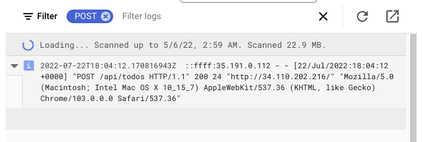
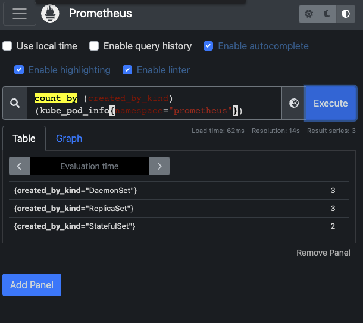
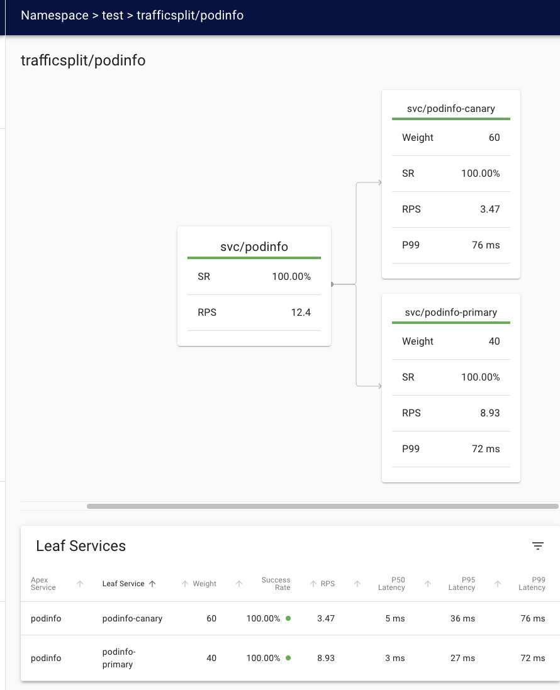

# dev_ops_with_kubernetes

## Database as a Service (DaS) vs do it yourself (Exercise 3.06)

### DaS pros

- No maintaining overhead
- A lot of fancy features for free such as scaling, backups, multiple instances
- Does not require a lot of domain knowledge from cloud, databases, infra, monitoring etc
- Enterprise support

### DaS cons

- Might seem more expensive
- Might provide features that are not useful
- Vendor lock in
- The vendor might impose limitations on features / config
- Can be proprietary, i.e. a black box

### DIY pros

- No vendor lock in
- In house domain knowledge about the DB solution
- Flexible
- A known entity. The features and tech stack is known.
- Can be simple if that fits the requirements

### DIY cons

- Expensive (human resources, infra)
- Requires a lot of domain knowledge. Aquiring it might be away from tackling concrete business problems.
- Maintenance burden
- Most likely not as reliable or "fancy" as vendored solutions.

## Exercise 3.07

I chose to use persistent volume claims in the todo project because it was straight forward to implement. I implemented at earlier stage and I guess then I mistakenly assumed that I had to deploy the project with db on top of persistent volume. Now here I am with the exercise 3.07 with that already implemented.

## Screen from todo creation logs (Exercise 3.10)

# Exercise 4.03

# Exercise 5.03

# Exercise 5.04: Platform comparison

<!--
Choose one service provider such as Rancher and compare it to another such as OpenShift.

Decide arbitrarily which service provider is "better" and argue for it against the other service provider.

For the submission a bullet point list is enough.
-->

I choose to compare Rancher to OpenShift. I've arbitraily decided that Rancher is "better" service provider than OpenShift.

Here's post-factum bullet point arguments:

- Installation and maintenance is quicker and easier
- Better multi-cloud and multi-cluster support
- The community around it bigger. Most likely the ease of installation and adoption has something to do with it.
- Supports hosted kubernetes deployments like EKS, GKE and AKS
- Better and non-proprietary load balancing out of the box
